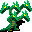
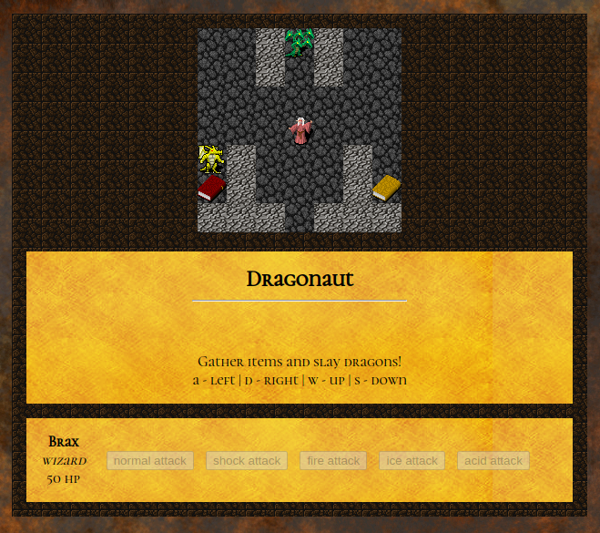
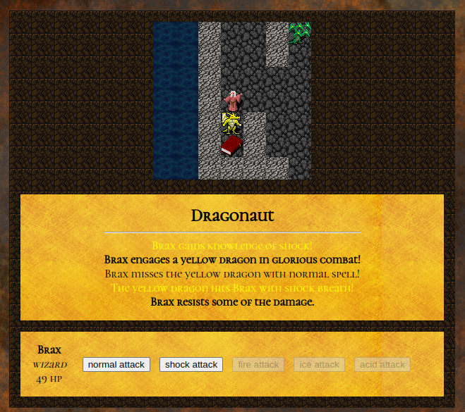
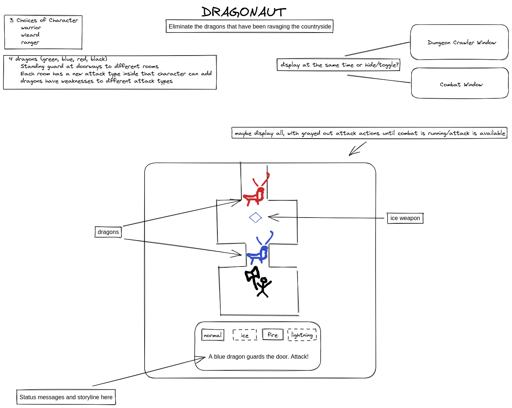
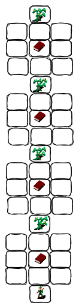

#  DRAGONAUT
SEIRFX 221 WC Project 1: Dragonaut

A simple fantasy RPG, inspired by Final Fantasy.

To play online, visit: https://dragonaut.netlify.app/

# HOW TO PLAY

* Move the character around the board using the `W` `A` `S` `D` keys.
* Collect books to gain elemental knowledge.
    * Knowledge of an element gives the character access to an attack of that type.
    * Knowledge also gives the character resistance to attacks of that type.
* Move into a square occupied by a dragon to engage it in combat. 
    * Click the attack buttons to launch attacks.
    * Dragons of different colors have strengths and weaknesses against different elements.
* Win the game by slaying all of the dragons, freeing the peasants from their reign of terror!
* If the character's HP falls to zero, the game is over!

### START SPLASH SCREEN


### MOVEMENT


### COMBAT


### ATTRIBUTION
All sprites and backgrounds are used under free license.
* Sprites: https://opengameart.org/content/dungeon-crawl-32x32-tiles
* Metallic background: https://opengameart.org/content/rusted-metal-texture-pack
* Parchment background: https://opengameart.org/content/varied-parchment


### HOW TO INSTALL
1. `Fork` and `Clone` this repository to your machine.
2. Open `index.html` in your browser to play Dragonaut.
3. Open `index.html`, `app.js`, and `style.css` in a text editor to view/edit the code.

### HOW IT WORKS
Dragonaut is comprised of two game phases:
1. `Movement`
    * A movement engine runs on a 60ms interval, constantly refreshing the map within view of the character.
    * In this phase, the `W` `A` `S` `D` keys move the character around the board.
    * Collision with a dragon stops the movement engine and transitions the game into the second mode.
2. `Combat`
    * The dragon attacks every five seconds.
    * The player clicks on the attack buttons to launch attacks.
    * When the player launches attacks, the buttons are disabled for three seconds, after which another attack can be launched.
    * When the dragon dies, the movement engine is restarted.
    * Or, if all dragons are dead, the game ends!

### CHARACTER, DRAGON, AND HYDRA CLASSES
The primary entities in the game are represented by the `Character` class and the `Dragon` class. The BBEG (big bad evil guy) is represented by a `Hydra` class, which extends the `Dragon` class. Unlike the other, lesser dragons, the Hydra must be defeated 5 times before it stays down. This is accomplished by incrementing a `phase` variable each time the Hydra would die. After the last head falls off, it's dead!

```javascript
class Hydra extends Dragon {
    ...
    this.phase = 5; // the hydra must be "killed" 5 times to actually die
    ...
    // called when an attack "kills" the hydra
    die() {
        // change the phase of the dragon and replenish health for phases 5-2
        // type of effective and resisted attacks change, as well as image
        switch (this.phase) {
            case 5:
                gameEvents.unshift({ text: this.headDown, class: 'emphasis' });
                this.effective = 'shock';
                this.resist = 'acid';
                this.img = hydraFour;
                this.health = 20;
                break;
            case 4:
                gameEvents.unshift({ text: this.headDown, class: 'emphasis' });
                this.effective = 'acid';
                this.resist = 'shock';
                this.img = hydraThree;
                this.health = 20;
                break;
    ...
            case 1: // for phase one, hydra actually dies
            super.die();
            return true;
            break;
        }
        this.render(); // redraw the hydra 
        this.phase--; // hydra phase number is decremented
    }
```

### THE MAP
Dragonaut uses an HTML `<canvas>` to draw the game.

The map is stored in a two-dimensional array.

```javascript
let map = [
//    0    1    2    3    4    5    6    7    8
    ['0', '0', '0', '0', '0', '0', '0', '0', '0'], // 00
    ['0', 'w', '0', '-', '-', '-', '0', 'g', '0'], // 01
    ['0', 'W', '0', '-', '-', '-', '0', 'R', '0'], // 02
    ['0', '-', '-', '-', '-', '-', '-', '-', '0'], // 03
    ['0', '-', '-', '0', '0', '0', '-', '-', '0'], // 04
    ['0', '-', '-', '0', 'G', '0', '-', '-', '0'], // 05
    ['0', '-', '-', '0', '-', '0', '-', '-', '0'], // 06
    ['0', '-', '-', '-', '-', '-', '-', '-', '0'], // 07
    ['0', '-', '-', '-', '-', '-', '-', '-', '0'], // 08
    ['0', 'Y', '0', '-', '-', '-', '0', '-', '0'], // 09
    ['0', 'r', '0', '-', '-', '-', '0', 'y', '0'], // 10
    ['0', '0', '0', '0', '-', '0', '0', '0', '0'], // 11
    ['0', '0', '0', '0', 'C', '0', '0', '0', '0']  // 12
];
```


#### LEGEND
* G = green dragon, W = white dragon, R = red dragon, Y = yellow dragon
* g = green book, w = white book, r = red book, y = yellow book
* C = character
* 0 = wall tile
* \- = floor tile
* 0 values are used by renderMap function to create functional barriers
* other values are for easily visually laying out the map and have no functional effect

The game uses the array to render the visible portion of the map.

```javascript
// draw the (viewRange * 2 + 1) by (viewRange * 2 + 1) map square around character
function renderMap() {

    // game map coordinates relative to character
    let startX = character.x - viewRange;
    let endX = character.x + viewRange;
    let startY = character.y - viewRange;
    let endY = character.y + viewRange;


    // we map each map square into a corresponding square on the HTML canvas
    // char and canvas variables initialized here
    let charX;
    let charY
    let canvasY;
    let canvasX;

    // iterate through both the character Y axis and canvas Y axis
    for (charY = startY, canvasY = 0; charY <= endY; charY++, canvasY++) {
        
        // iterate through the both the character X axis and canvas X axis
        for (charX = startX, canvasX = 0; charX <= endX; charX++, canvasX++) {

            // check if coordinates describe a square within the game map
            if (
                charX >= 0 // x coordinate is within left side of map
                && charX < map[0].length // x coordinate is within right side of map
                && charY >= 0 // y coordinate is within top of map
                && charY < map.length // y coordinate is within bottom of map
            ) {
                switch (map[charY][charX]) {
                    case '0': // wall, draw wall tile
                        ctx.drawImage(wallTile, canvasX * gridSize, canvasY * gridSize, gridSize, gridSize);
                        break;
                    default: // floor, draw floor tile
                        ctx.drawImage(floorTile, canvasX * gridSize, canvasY * gridSize, gridSize, gridSize);
                        break;
                }
            } else { // off the map, draw darkness
                ctx.drawImage(darkTile, canvasX * gridSize, canvasY * gridSize, gridSize, gridSize);
            }
        }
    }
}
```
### COLLISION DETECTION
Each character, enemy, or item fits exactly into a 32x32 square on the map, and is represented by X and Y coordinates in the two-dimensional `map` array. This makes collision detection a relatively simple matter.

Snippet from `checkForCollisions()`

```javascript
dragons.forEach((d) => {
    // if player collides with a dragon, i.e. x and y coordinates are the same
    if(d.alive && d.x === character.x && d.y === character.y) {
        gameEvents.unshift({ text: `${character.name} engages a ${d.name} in glorious combat!`, class: 'emphasis' });
        combat(d); // combat begins
    }
});
```

## INTO THE FUTURE

### REVAMP COMBAT
If I return to this project in the future, I'd like to revamp the `Combat` phase of the game, changing the display to a side-view with space between the character and enemy. This would create some real estate to use for attack animations.

### MORE COMPLEX LEVELS, EXTENDED GAMEPLAY
I'd also like to use this game engine to build some longer, more complex levels to figure out.

## WHITEBOARDS

### INITIAL BRAINSTORM SESSION


### INITIAL GRID LAYOUT


[](https://app.netlify.com/sites/dragonaut/deploys)